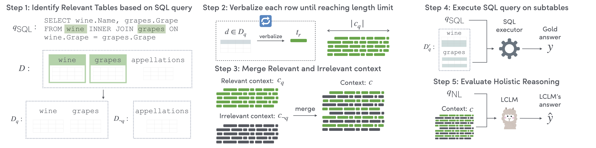

# 🫧 HoloBench

<p align="center">
    💿 <a href="https://huggingface.co/datasets/megagonlabs/holobench" target="_blank">Data</a>
    • 📃 <a href="https://arxiv.org/abs/2410.11996" target="_blank">Paper</a>
</p>

Implementation of paper:
* Seiji Maekawa*, Hayate Iso*, Nikita Bhutani (*eqaul contributions). *Holistic Reasoning with Long-Context LMs: A Benchmark for Database Operations on Massive Textual Data*

<p align="center" width="100%">
<a ></a>
</p>

## 🔧 HoloBench Setup

```sh
conda create -n holobench python=3.10
conda activate holobench
pip install git+https://github.com/megagonlabs/holobench.git
```

## 🚀 Quick tour
The following gives a quick overview of how to use HoloBench for evaluating holistic reasoning tasks.

### Loading Queries and Contexts
First, load a sample query from the HoloBench dataset:

```python
from datasets import load_dataset
from holobench import load_context
from litellm import completion

queries = load_dataset("megagonlabs/holobench", name="queries")
db_id = "wine_1"
ins = queries[db_id][0]
ins["query"]
```
The sample query looks like this:

```python
'SELECT wine.Name, grapes.Grape FROM wine INNER JOIN grapes ON wine.Grape = grapes.Grape'
```

This snippet loads a SQL query from the `wine_1` database in the HoloBench dataset. The queries dataset contains SQL-like queries used for evaluating language models.

### Loading the Dataset and Context
Now, load the dataset and retrieve the context for the query:

```python
db = load_dataset("megagonlabs/holobench", name=db_id)
context, gold_answer = load_context(ins["query"],
                                    db,
                                    max_context_size=4096,
                                    info_amount=2048,
                                    merge_strategy="uniform")
```

### Executing Holistic Reasoning
Finally, generate a prediction using a long-context language model:

```python
template = open("./holobench/prompts/experiment_prompt.txt").read()
content = template.format(context=context, question=ins['question'])
response = completion(model="gpt-4o-mini-2024-07-18",
                      messages=[{"role": "user", "content": content}],
                      temperature=0.)
prediction = response.choices[0].message.content
prediction
```

The output from the model looks like this:

```python
"To answer the question regarding the names of wines and their corresponding grape types, I carefully reviewed the provided sentences for any mentions of specific wines along with the grape varieties used to produce them. \n\nHere are the findings:\n\n1. **2008 Old Kraft Vineyard by Robert Biale** - Grape Type: Zinfandel\n2. **2008 Giana by Chiarello Family** - Grape Type: Zinfandel\n..."
```

## 📚 Citations
```bibtex
@misc{maekawa2025holistic,
  title={Holistic Reasoning with Long-Context LMs: A Benchmark for Database Operations on Massive Textual Data},
  author={Seiji Maekawa\textsuperscript{*} and Hayate Iso\textsuperscript{*} and Nikita Bhutani},
  year={2024},
  note={\textsuperscript{*}These authors contributed equally to this work.},
  url={https://arxiv.org/abs/2410.11996}
}
```

## 📜 Disclosure
Embedded in, or bundled with, this product are open source software (OSS) components, datasets and other third party components identified below. The license terms respectively governing the datasets and third-party components continue to govern those portions, and you agree to those license terms, which, when applicable, specifically limit any distribution. You may receive a copy of, distribute and/or modify any open source code for the OSS component under the terms of their respective licenses, which may be BSD 3 clause license and Apache 2.0 license. In the event of conflicts between Megagon Labs, Inc., license conditions and the Open Source Software license conditions, the Open Source Software conditions shall prevail with respect to the Open Source Software portions of the software. 
You agree not to, and are not permitted to, distribute actual datasets used with the OSS components listed below. You agree and are limited to distribute only links to datasets from known sources by listing them in the datasets overview table below. You are permitted to distribute derived datasets of data sets from known sources by including links to original dataset source in the datasets overview table below. You agree that any right to modify datasets originating from parties other than Megagon Labs, Inc. are governed by the respective third party’s license conditions. 
All OSS components and datasets are distributed WITHOUT ANY WARRANTY, without even implied warranty such as for MERCHANTABILITY or FITNESS FOR A PARTICULAR PURPOSE, and without any liability to or claim against any Megagon Labs, Inc. entity other than as explicitly documented in this README document. You agree to cease using any part of the provided materials if you do not agree with the terms or the lack of any warranty herein.
While Megagon Labs, Inc., makes commercially reasonable efforts to ensure that citations in this document are complete and accurate, errors may occur. If you see any error or omission, please help us improve this document by sending information to contact_oss@megagon.ai.